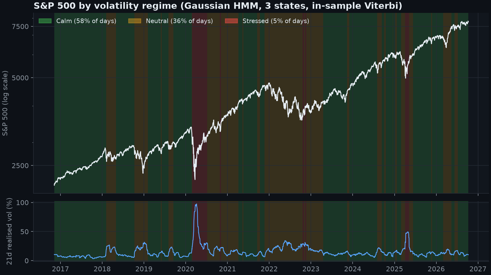
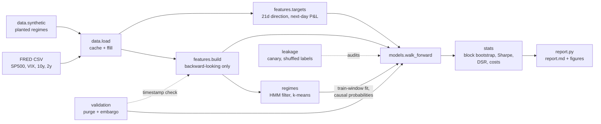
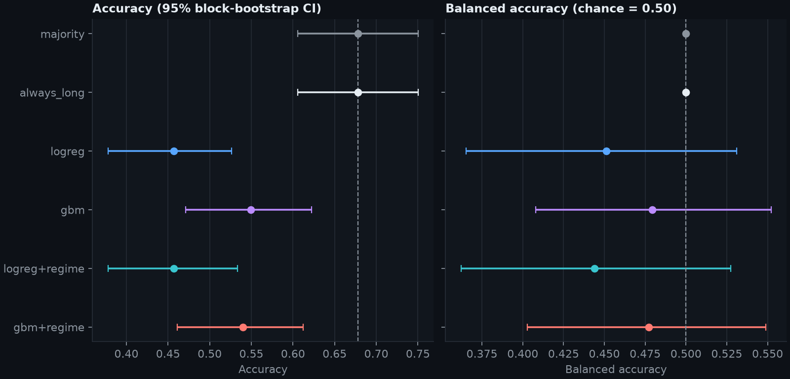
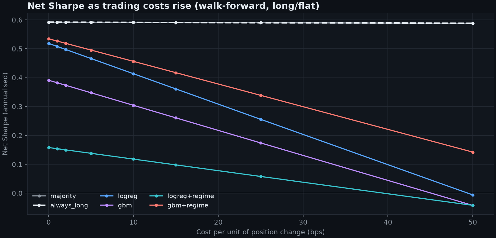

# meridian-trader

Market-regime research on the S&P 500: HMM regimes, purged walk-forward validation, leakage tests and a deflated Sharpe ratio, with an honest verdict.

[](https://github.com/armaghanrashid/meridian-trader/actions/workflows/ci.yml)



Research, not financial advice. Nothing here is a recommendation to buy or sell anything.

## Why it's interesting

- **The result is a null, and the pipeline is built to tell you that.** Over 1638 out-of-sample days (2020-01-21 to 2026-07-28) no model beats an always-long baseline on accuracy or on cost-adjusted Sharpe, and the deflated Sharpe ratio agrees. The interesting part is that every number comes with an interval and a leakage check, so the null is credible.
- **Leakage is tested, not assumed.** Purged splits with an embargo; a perturbation-based timestamp check that proves every feature at time *t* ignores data after *t*; a planted future-feature canary that the check must flag (it does, and a model fed it hits 0.959 balanced accuracy); and a shuffled-label test that must land at chance (it does: 0.501).
- **Statistics that respect dependence and selection.** Moving-block bootstrap intervals (overlapping 21-day labels), regime probabilities from the causal forward filter rather than the hindsight Viterbi path, and a deflated Sharpe ratio (Bailey and Lopez de Prado) that charges for picking the best of several trials. A positive-control test on synthetic data with planted regimes shows the same pipeline *can* find an edge when one exists.

## Architecture



## Quickstart

Python 3.12. No API key is needed; data comes from FRED's public CSV endpoint and is cached in `data/cache/` (gitignored).

```bash
git clone https://github.com/armaghanrashid/meridian-trader.git
cd meridian-trader
make setup     # creates .venv and installs pinned requirements
make test      # 58 tests on synthetic data, no network
make report    # downloads data, writes reports/report.md and reports/figures/*.png
```

`make notebook` rebuilds `notebooks/01_explore.ipynb` (outputs cleared except the final figures). Delete `data/cache/*.csv` (or `make clean`) to refresh the data.

## Results

From `make report` on FRED data through 2026-10-08 (2513 trading days from 2016-10-10; FRED serves roughly the last decade of SP500). Walk-forward: train 756 days, embargo 5, test 126 days, 13 folds, label horizon 21 days. Long when the model predicts up, flat otherwise; 5 bps per unit of position change; risk-free rate zero. Intervals are 95% moving-block bootstrap. Full output: [`reports/report.md`](reports/report.md).

**Verdict: no statistically reliable edge.** The best candidate by net Sharpe, `gbm+regime`, earns a net Sharpe of 0.50 against 0.59 for buy-and-hold (difference -0.10, 95% CI -0.42 to +0.26). In a market that rose in 67.8% of 21-day windows, always predicting up is hard to beat on accuracy: all four candidates are significantly worse than that baseline (every paired 95% interval for the accuracy difference lies below zero), and none of their Sharpe differences against buy-and-hold is significantly positive.

Direction accuracy (out-of-sample, 1638 days):

| model | accuracy | 95% CI | balanced acc. | accuracy minus always-long (95% CI) |
|---|---|---|---|---|
| majority | 0.678 | 0.606 to 0.750 | 0.500 | +0.000 (+0.000 to +0.000) |
| always_long | 0.678 | 0.606 to 0.750 | 0.500 | - |
| logreg | 0.457 | 0.378 to 0.526 | 0.451 | -0.222 (-0.332 to -0.117) |
| gbm | 0.549 | 0.471 to 0.622 | 0.479 | -0.129 (-0.217 to -0.045) |
| logreg+regime | 0.457 | 0.378 to 0.534 | 0.444 | -0.222 (-0.331 to -0.113) |
| gbm+regime | 0.540 | 0.461 to 0.612 | 0.477 | -0.139 (-0.229 to -0.054) |

Strategy performance after 5 bps costs, with deflated Sharpe ratios (DSR) for 4 trials (the candidate models) and 50 trials (a more honest count that includes features, windows and k):

| strategy | net Sharpe | gross Sharpe | ann. return | max drawdown | Sharpe minus buy-hold (95% CI) | DSR, 4 trials | DSR, 50 trials |
|---|---|---|---|---|---|---|---|
| majority | 0.592 | 0.592 | 12.1% | -33.9% | +0.00 (+0.00 to +0.00) | 0.855 | 0.712 |
| always_long | 0.592 | 0.592 | 12.1% | -33.9% | - | 0.855 | 0.712 |
| logreg | 0.466 | 0.519 | 6.4% | -27.8% | -0.13 (-0.79 to +0.55) | 0.775 | 0.598 |
| gbm | 0.348 | 0.391 | 6.5% | -31.5% | -0.24 (-0.56 to +0.03) | 0.672 | 0.478 |
| logreg+regime | 0.138 | 0.158 | 2.4% | -30.7% | -0.45 (-0.92 to -0.04) | 0.467 | 0.278 |
| gbm+regime | 0.495 | 0.535 | 9.0% | -31.2% | -0.10 (-0.42 to +0.26) | 0.792 | 0.624 |

`majority` equals `always_long` because the training-window majority class was always "up".





Leakage checks on the real data: split integrity asserted on all 13 folds; real features flagged by the timestamp check: none; canary `canary_future` flagged: yes; shuffled-label balanced accuracy 0.501 against a null interval of 0.474 to 0.526 (passed).

One in-sample observation from the regime fit worth knowing: the HMM's stressed state (5% of days, 49% annualised volatility) has a *positive* mean return, because sharp rebounds follow sell-offs. A rule that sells when volatility spikes does not describe this sample.

## Testing

```bash
make test        # pytest -q, synthetic data only
make lint        # ruff check + ruff format --check
```

58 tests, no network. Highlights:

- the HMM recovers the planted regimes (adjusted Rand index above 0.6) and labels are ordered by volatility;
- filtered regime probabilities at *t* equal those computed on data truncated at *t* (causality);
- purged splits never overlap the embargo window, across a grid of horizons and embargoes, and a bad split raises `LeakageError`;
- features are invariant to deleting all future data, and the planted canary and a subtler one-day peek are both flagged;
- the deflated Sharpe ratio matches an independent standard-library reference to within 1e-6;
- a positive control: on synthetic data where the regime drives returns, the walk-forward pipeline finds an edge whose interval excludes chance, so the real-data null is not the pipeline being dead.

CI (`.github/workflows/ci.yml`) runs lint and the tests on `ubuntu-latest` without network.

## Design decisions and trade-offs

- **Filtered, not smoothed, regimes in models.** Viterbi labels use the whole sequence and leak the future; models receive forward-filter probabilities from an HMM fitted on the training window only. The smoothed path appears only in the descriptive chart and is labelled as hindsight.
- **Purge and embargo.** A training label at *t* uses data through *t+21*, so any training row whose label reaches the test window is dropped, and a further gap (the embargo) separates train from test. Test blocks tile the series, producing one contiguous out-of-sample track.
- **Balanced accuracy for the shuffled-label test.** With about 68% up-days, raw accuracy of a label-independent predictor is not 50%, so the "chance" test uses balanced accuracy, whose null is exactly 0.5 with a closed-form interval.
- **Block bootstrap, not i.i.d.** 21-day labels overlap and volatility clusters, so a block length equal to the horizon is used for every interval, including paired differences against the baseline.
- **Timestamp check by perturbation.** Instead of trusting a declared "uses data through t", the check corrupts everything after random probe times and flags any feature whose past values move.
- **No tuning.** Hyper-parameters are fixed before looking at results. Tuning on the validation folds would add selection bias; the deflated Sharpe shows how fast that bias adds up (4 trials versus 50).
- **Drawdown is a model feature but not a regime feature.** It broke recovery of the planted synthetic regimes (path dependence), so the regime model uses realised volatility, VIX and 21-day momentum.
- **Limits.** One market, about ten years, one path; index levels exclude dividends; a flat per-trade cost and no slippage model; zero risk-free rate. A positive result would be a hypothesis to replicate, not a finding.

## Licence

Copyright (c) 2026 Muhammad Armaghan Rashid. All rights reserved. Published for viewing only; see [LICENSE](LICENSE).
