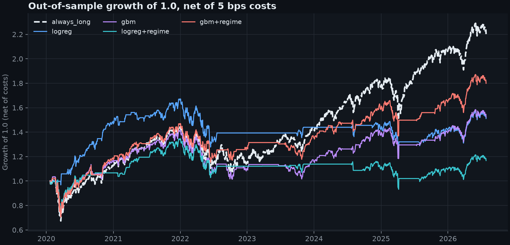

# Meridian: market-regime research report

Generated by `python -m meridian.report`. Research, not financial advice.

## Conclusions

- Best candidate by net Sharpe at 5 bps: `gbm+regime` (net Sharpe 0.50 vs 0.59 for buy-and-hold). Its accuracy is 0.540 against 0.678 for always-long (-0.139, 95% CI -0.229 to -0.054).
- Sharpe difference vs buy-and-hold: -0.10 (95% CI -0.42 to +0.26). Deflated Sharpe ratio with 4 trials: 0.79.
- Result: no statistically reliable edge. No candidate beats always-long on accuracy with an interval excluding zero. The best candidate is long on 67% of days, so most of its return is the equity risk premium that buy-and-hold already collects.
- Leakage checks: the shuffled-label balanced accuracy was 0.501 (null interval 0.474 to 0.526, passed); the planted future-feature canary was flagged by the timestamp check and a model fed it reached 0.959 balanced accuracy (the signature of leakage); the real features were clean.

## Data and protocol

- FRED daily series SP500, VIXCLS, DGS10, DGS2; 2016-10-10 to 2026-10-08 (2513 trading days, 2429 labelled samples after warm-up and the unlabelled tail).
- Target: does the S&P 500 close higher 21 trading days later (direction of the log return).
- Purged walk-forward, rolling window: train 756 days, embargo 5, test 126 days, labels purged where they overlap the test window; 13 folds, 1638 out-of-sample days (2020-01-21 to 2026-07-28).
- Strategy: long the index when the model predicts up, flat otherwise, decided at the close and earning the next day's return. Costs are charged per unit of position change (base case 5 bps). Risk-free rate taken as zero.
- Confidence intervals are moving-block bootstrap (block length = label horizon) because overlapping 21-day labels make observations dependent.

## Regimes (descriptive, in-sample)

Volatility clustering is present: the Ljung-Box statistic (10 lags) is 2736 for squared daily returns (p < 1e-300) against 254 for returns (p 6.6e-49): the size of moves is far more persistent than their direction. States are ordered by realised volatility. Labels below are Viterbi-smoothed over the whole sample, so they use hindsight and are never fed to a model.

Gaussian HMM:

| regime | share of days | ann_return | ann_vol | avg spell (days) |
|---|---|---|---|---|
| Calm | 58% | +20.3% | 9.9% | 80.5 |
| Neutral | 36% | -0.7% | 19.9% | 41.3 |
| Stressed | 5% | +28.2% | 48.8% | 27.0 |

k-means baseline (no time structure):

| regime | share of days | ann_return | ann_vol | avg spell (days) |
|---|---|---|---|---|
| Calm | 74% | +32.4% | 10.8% | 27.4 |
| Neutral | 25% | -40.0% | 25.2% | 9.4 |
| Stressed | 1% | -66.5% | 92.0% | 24.0 |

Adjusted Rand index between the two labelings: 0.445. The HMM's persistence prior is visible in the longer average spells. The stressed regime has a positive in-sample mean return, the opposite of what an 'avoid high volatility' rule assumes: the smoothed path also labels the sharp rebounds that follow sell-offs as stressed.

## Leakage checks

- Split integrity asserted on all 13 folds (no train/test overlap, labels purged, embargo respected).
- Timestamp check on the real features, flagged columns: none.
- Planted canary `canary_future` flagged: ['canary_future']; a model given it scores 0.959 balanced accuracy.
- Shuffled-label test (20 shuffles): mean balanced accuracy 0.501, null 95% interval 0.474 to 0.526: passed.

## Out-of-sample direction accuracy

| model | accuracy | 95% CI | balanced acc. | 95% CI  | acc. minus always-long (95% CI) | % days long |
|---|---|---|---|---|---|---|
| majority | 0.678 | 0.606 to 0.750 | 0.500 | 0.500 to 0.500 | +0.000 (+0.000 to +0.000) | 100% |
| always_long | 0.678 | 0.606 to 0.750 | 0.500 | 0.500 to 0.500 | - | 100% |
| logreg | 0.457 | 0.378 to 0.526 | 0.451 | 0.365 to 0.531 | -0.222 (-0.332 to -0.117) | 50% |
| gbm | 0.549 | 0.471 to 0.622 | 0.479 | 0.408 to 0.552 | -0.129 (-0.217 to -0.045) | 69% |
| logreg+regime | 0.457 | 0.378 to 0.534 | 0.444 | 0.362 to 0.527 | -0.222 (-0.331 to -0.113) | 52% |
| gbm+regime | 0.540 | 0.461 to 0.612 | 0.477 | 0.403 to 0.549 | -0.139 (-0.229 to -0.054) | 67% |

## Strategy results (5 bps per unit of position change)

| strategy | net Sharpe | gross Sharpe | ann. return | max drawdown | turnover/day | Sharpe minus buy-hold (95% CI) |
|---|---|---|---|---|---|---|
| majority | 0.592 | 0.592 | 12.1% | -33.9% | 0.001 | +0.00 (+0.00 to +0.00) |
| always_long | 0.592 | 0.592 | 12.1% | -33.9% | 0.001 | - |
| logreg | 0.466 | 0.519 | 6.4% | -27.8% | 0.057 | -0.13 (-0.79 to +0.55) |
| gbm | 0.348 | 0.391 | 6.5% | -31.5% | 0.064 | -0.24 (-0.56 to +0.03) |
| logreg+regime | 0.138 | 0.158 | 2.4% | -30.7% | 0.027 | -0.45 (-0.92 to -0.04) |
| gbm+regime | 0.495 | 0.535 | 9.0% | -31.2% | 0.057 | -0.10 (-0.42 to +0.26) |

## Deflated Sharpe ratio

PSR is the probability the true Sharpe exceeds zero. DSR additionally deflates for selecting the best of N trials (Bailey and Lopez de Prado, 2014), using the variance of per-period Sharpe across the 4 candidate models (0.000105). Four is a floor: features, windows, k and horizon were also chosen by the author, so the 10 and 50 trial columns are the more honest reading.

| strategy | PSR vs 0 | DSR, 4 trials | DSR, 10 trials | DSR, 50 trials |
|---|---|---|---|---|
| majority | 0.931 | 0.855 | 0.801 | 0.712 |
| always_long | 0.931 | 0.855 | 0.801 | 0.712 |
| logreg | 0.884 | 0.775 | 0.705 | 0.598 |
| gbm | 0.810 | 0.672 | 0.592 | 0.478 |
| logreg+regime | 0.637 | 0.467 | 0.382 | 0.278 |
| gbm+regime | 0.893 | 0.792 | 0.726 | 0.624 |

## Cost sensitivity

| net Sharpe at cost (bps) | 0 | 1 | 2 | 5 | 10 | 15 | 25 | 50 |
|---|---|---|---|---|---|---|---|---|
| majority | 0.592 | 0.592 | 0.592 | 0.592 | 0.591 | 0.591 | 0.590 | 0.588 |
| always_long | 0.592 | 0.592 | 0.592 | 0.592 | 0.591 | 0.591 | 0.590 | 0.588 |
| logreg | 0.519 | 0.508 | 0.498 | 0.466 | 0.413 | 0.361 | 0.256 | -0.006 |
| gbm | 0.391 | 0.382 | 0.374 | 0.348 | 0.304 | 0.261 | 0.174 | -0.043 |
| logreg+regime | 0.158 | 0.154 | 0.150 | 0.138 | 0.118 | 0.098 | 0.058 | -0.042 |
| gbm+regime | 0.534 | 0.527 | 0.519 | 0.495 | 0.456 | 0.417 | 0.339 | 0.142 |

## Limitations

- One market and about ten years of history (FRED publishes only a rolling decade of SP500), with one realised path: a single regime-rich stretch that includes the 2020 crash and the 2022 bear market.
- Index levels exclude dividends; VIX is observed at the close, so a live implementation would need the same timestamp discipline. No slippage model beyond the flat per-trade cost.
- Hyper-parameters were fixed before looking at results to avoid adding selection bias; a tuned model would need a nested validation scheme.
